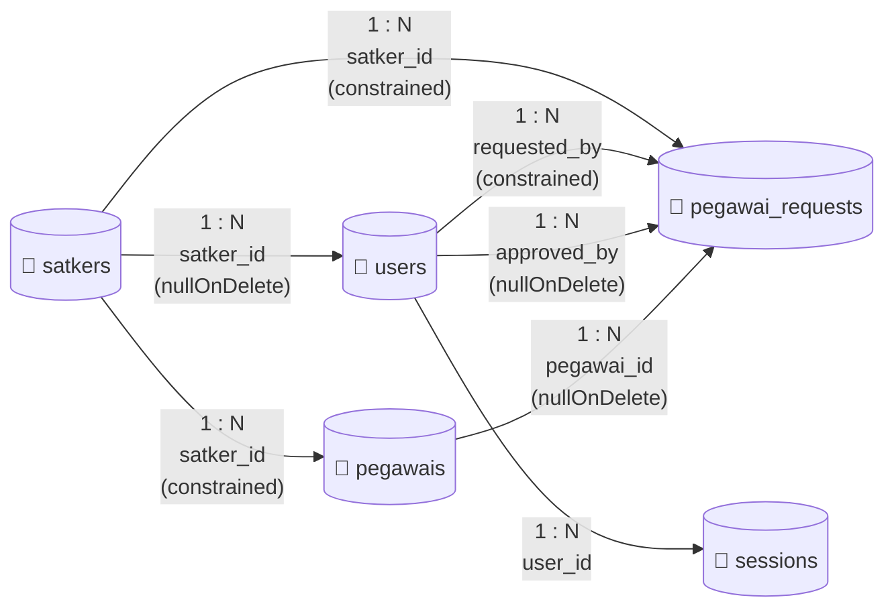
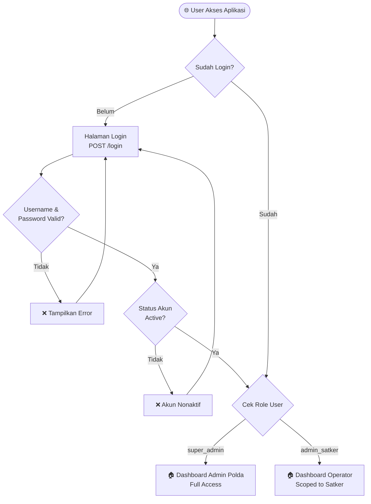
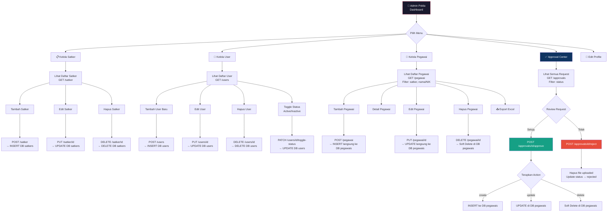
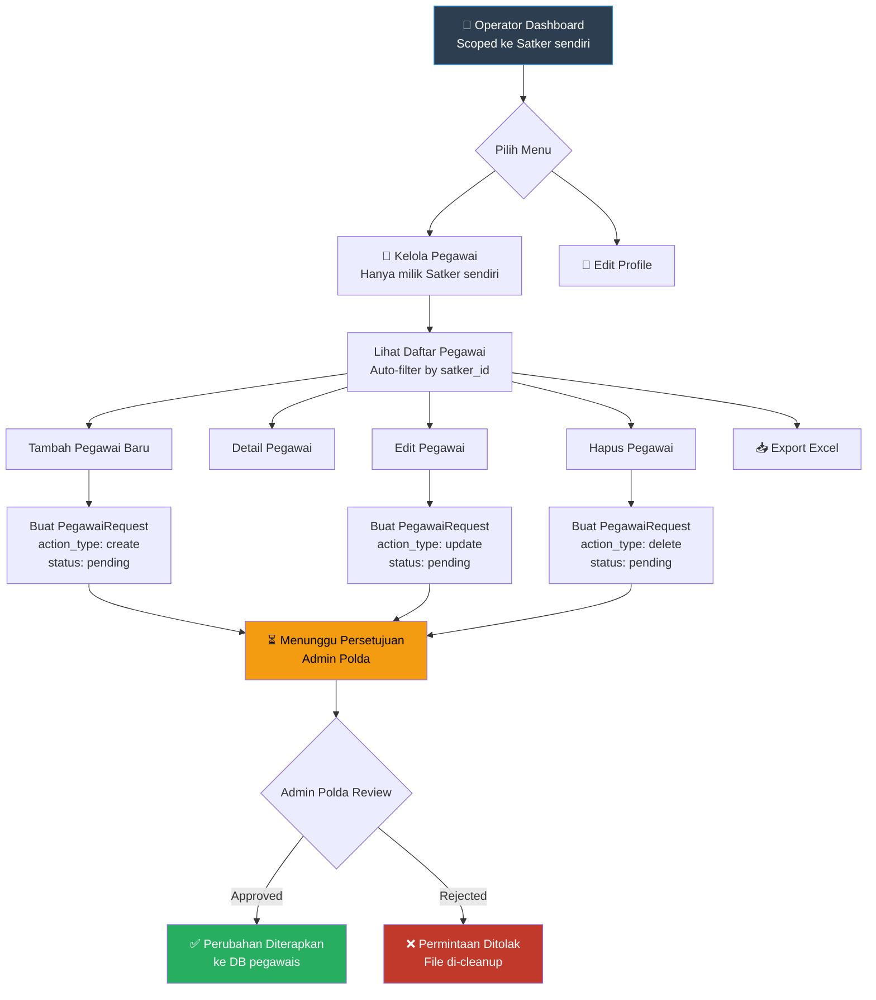
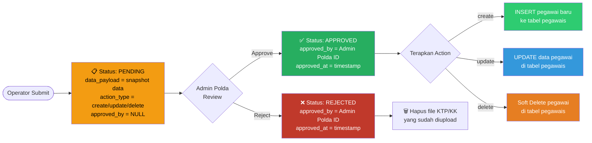

# 📊 Flowchart Sistem Informasi Pegawai Honorer

Dokumen ini berisi **flowchart database** dan **flowchart alur kerja aplikasi** hasil analisis mendalam terhadap seluruh migration, model, controller, route, dan data JSON ekspor database.

---

## 1. Flowchart Database (Struktur & Relasi Tabel)

### 1A. Struktur Tabel Utama

```mermaid
flowchart TB
    subgraph SATKERS["📋 Tabel: satkers"]
        direction TB
        S_ID["🔑 id (PK, bigint)"]
        S_NAMA["nama_satker (varchar, UNIQUE)"]
        S_CA["created_at (timestamp)"]
        S_UA["updated_at (timestamp)"]
    end

    subgraph USERS["👥 Tabel: users"]
        direction TB
        U_ID["🔑 id (PK, bigint)"]
        U_NAME["name (varchar)"]
        U_USER["username (varchar, UNIQUE)"]
        U_PASS["password (varchar)"]
        U_TOKEN["remember_token (varchar)"]
        U_ROLE["role (enum: super_admin | admin_satker)"]
        U_SATKER["🔗 satker_id (FK → satkers.id, nullable)"]
        U_STATUS["status (enum: active | inactive)"]
        U_CA["created_at (timestamp)"]
        U_UA["updated_at (timestamp)"]
    end

    subgraph PEGAWAIS["📄 Tabel: pegawais"]
        direction TB
        P_ID["🔑 id (PK, bigint)"]
        P_NAMA["nama (varchar)"]
        P_NIK["nik (varchar, UNIQUE)"]
        P_JK["jenis_kelamin (varchar, nullable)"]
        P_FOTO["foto (varchar, nullable - path file)"]
        P_PEND["pendidikan (varchar)"]
        P_SATKER["🔗 satker_id (FK → satkers.id)"]
        P_STATUS["status (enum: aktif | non_aktif)"]
        P_KTP["file_ktp (varchar, nullable - path file)"]
        P_KK["file_kk (varchar, nullable - path file)"]
        P_CA["created_at (timestamp)"]
        P_UA["updated_at (timestamp)"]
        P_DA["deleted_at (timestamp - SoftDeletes)"]
    end

    subgraph REQUESTS["📝 Tabel: pegawai_requests"]
        direction TB
        R_ID["🔑 id (PK, bigint)"]
        R_PEG["🔗 pegawai_id (FK → pegawais.id, nullable)"]
        R_SATKER["🔗 satker_id (FK → satkers.id)"]
        R_REQBY["🔗 requested_by (FK → users.id)"]
        R_ACTION["action_type (enum: create | update | delete)"]
        R_DATA["data_payload (JSON, nullable)"]
        R_STATUS["status (enum: pending | approved | rejected)"]
        R_APPBY["🔗 approved_by (FK → users.id, nullable)"]
        R_APPAT["approved_at (timestamp, nullable)"]
        R_CA["created_at (timestamp)"]
        R_UA["updated_at (timestamp)"]
    end

    subgraph SESSIONS["🔐 Tabel: sessions"]
        direction TB
        SS_ID["🔑 id (PK, varchar)"]
        SS_USER["🔗 user_id (FK → users.id, nullable)"]
        SS_IP["ip_address (varchar, nullable)"]
        SS_UA["user_agent (text, nullable)"]
        SS_PL["payload (longtext)"]
        SS_LA["last_activity (int)"]
    end

    subgraph PRT["🔑 Tabel: password_reset_tokens"]
        direction TB
        PRT_EMAIL["🔑 email (PK, varchar)"]
        PRT_TOKEN["token (varchar)"]
        PRT_CA["created_at (timestamp, nullable)"]
    end
```

### 1B. Relasi Antar Tabel (Foreign Key)

### Penjelasan Relasi Database

| Relasi | Tipe | Foreign Key | Constraint |
|--------|------|-------------|------------|
| `satkers` → `users` | One-to-Many | `users.satker_id` | `nullOnDelete` (jika satker dihapus, satker_id jadi NULL) |
| `satkers` → `pegawais` | One-to-Many | `pegawais.satker_id` | `constrained` (tidak bisa hapus satker jika masih ada pegawai) |
| `satkers` → `pegawai_requests` | One-to-Many | `pegawai_requests.satker_id` | `constrained` |
| `users` → `pegawai_requests` (pembuat) | One-to-Many | `pegawai_requests.requested_by` | `constrained` |
| `users` → `pegawai_requests` (approver) | One-to-Many | `pegawai_requests.approved_by` | `nullOnDelete` |
| `pegawais` → `pegawai_requests` | One-to-Many | `pegawai_requests.pegawai_id` | `nullable`, `nullOnDelete` |

> **PENTING:** Tabel `pegawais` menggunakan **SoftDeletes** — data tidak benar-benar dihapus dari database, hanya ditandai dengan `deleted_at`. Ini memastikan riwayat `pegawai_requests` tetap bisa di-trace.

---

## 2. Flowchart Alur Kerja Aplikasi (System Flow)

### 2A. Alur Autentikasi & Otorisasi

### 2B. Alur Utama Admin Polda

### 2C. Alur Operator (Admin Satker) — Dengan Approval Workflow

### 2D. Lifecycle Approval Request (pegawai_requests)

---

## 3. Ringkasan Arsitektur

### Role-Based Access Control (RBAC)

| Fitur | Admin Polda | Operator (Admin Satker) |
|-------|:-----------:|:----------------------:|
| Dashboard | ✅ Semua data | ✅ Data satker sendiri |
| Kelola Satker | ✅ CRUD langsung | ❌ |
| Kelola User | ✅ CRUD + toggle status | ❌ |
| Kelola Pegawai | ✅ CRUD langsung | ⏳ Via approval request |
| Approval Center | ✅ Review & approve/reject | ❌ |
| Export Excel | ✅ | ✅ |
| Edit Profile | ✅ | ✅ |

### Data Teraktual dari Database

Berdasarkan JSON ekspor:

| Tabel | Jumlah Record | Keterangan |
|-------|:---:|-------------|
| `satkers` | 3 | Bagian Umum, Bagian Keuangan, Bagian Kepegawaian |
| `users` | 2 | 1 Admin Polda, 1 Operator (Satker Umum) |
| `pegawais` | 20 | 8 di Satker 1, 6 di Satker 2, 6 di Satker 3 |
| `pegawai_requests` | 0 | Belum ada request yang diajukan |
| `sessions` | 0 | Tidak ada session aktif |

> **CATATAN:** Semua 14 migration sudah berhasil dijalankan dalam 1 batch, menandakan database dalam kondisi konsisten dan up-to-date.
